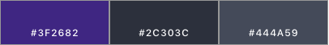

# Design Portfolio

## ViiMe

ViiMe was a project created by my best friend and one of his friends. The idea was that venue owners could provide unique deals to people if they come in groups. The project required creating a web application for venue owners and a mobile application for patrons. 

There were certain requirements laid out from the founders, and they were as follows:

1. The mobile application must be available on both iOS and Android
2. The mobile application and web application must be made within three months for launch
3. The color scheme must be dark, consisting mainly of the following colors: 

### Mobile

#### Background
The mobile application was the method for patrons to easily redeem deals at specific venues. They would need to search through venues, find a deal they like, and then be able to redeem it. The venues initially targetted were solely in Ottawa, since that was where my best friend went to school. This made it a little more challenging since a lot of communication went through him.

Currently, the application flow is as follows and it will be explained in more detail after:

 

##### Login
When the user first opens the application, they will land on the Login page. They must enter a username and password to login. If they do not have an account, they can click a 'CREATE AN ACCOUNT' button. If they forgot their password, they can click the 'FORGOT PASSWORD?' button.

#####

####  User Requirements

### Web - Coming Soon
