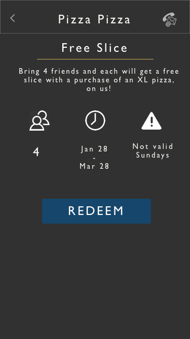
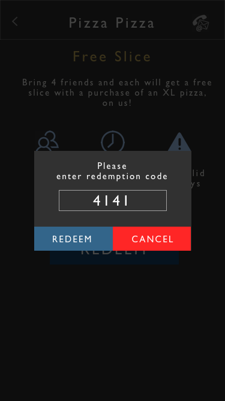

# ViiMe

ViiMe was a project created by my best friend and one of his friends. The idea was that venue owners could provide unique deals to people if they come in groups. The project required creating a web application for venue owners and a mobile application for patrons. This portfolio will focus on the mobile application.

There major requirement was that the application must be available on both iOS and Android

### Background
The mobile application was the method for patrons to easily redeem deals at specific venues. They would need to search through venues, find a deal they like, and then be able to redeem it. 

When the user first opens the application, they will land on the Login page. They must enter a username and password to login. If they do not have an account, they can click a 'Not a member? Sign up now!' button. If they forgot their password, they can click the 'Forgot Password?' button.

After they login, they will head to the groups page. To redeem deals, users must form groups by inviting their friends. If there are any active groups to redeem deals, this is where they will appear. The reason for having groups is that we can track who has redeemed what deal, and this information can be conveyed to venue owners. They can redeem any deals or invite friends to deals on this page. When they want to redeem, a pop-up appears where a code must be entered. Employees at venues know this code, and would enter it in for the deal to be redeemed.

From this page, there are 3 places to go: the profile page, friends list page, or to browsing venues.

The profile page is where users can update their personal information. Another feature the founders wanted was 'vRewards'. 
There were rewards sent directly from venue owners to users to thank them for their loyalty.  

          
The friends list page lists all friends, and there is a button to add a friend. When adding a friend, they will type in the username of their friend and all possible matches will show up in their search.

Finally, they can browse venues. On this page, all venues with deals are listed. They can search through the venues and when they click on one, they will see venue information and deals. If they click on a deal, they will see the possible things they can redeem depending on how big their group is. On the top right, there is a button to invite friends to their group.

To summarize, the current application flow is shown below.

 

The next step will be to improve the interface through this course. We will start afresh with user requirements.

####  User Requirements

##### User Interviews
With the application published, feedback was collected from users. Furthermore, I asked 3 friends with no prior knowledge of the application some questions. I wanted to see how they would navigate the application and where some chokepoints for users might be, along with their general impressions of the application.

I asked three simple questions which I thought would give some key insights. They are as follows:

1. Please redeem a deal (the deal to redeem was given)
2. What are your overall impressions of the application?
3. What would you improve?

To summarize findings, here are the key points:

- Users really did not understand the concept of having to create a group, invite your friends (which means adding friends to your friends list), and then redeeming.
-  There were some layout concerns, especially with the venue information page and deals page.
- They liked the idea of the application, and the deals offered
- They did not understand what vRewards were

The major point of concern is not understanding the concept of a group and why that was necessary. From a business stand point, the founders really wanted to be able to track exactly who was redeeming what deals. They wanted to use this information and sell it to business owners. This was something I pushed to them earlier that this whole process of creating groups would be a big headache for users (and to implement). After conducting these interviews, I brought it up with them again and pushed them on it. They finally gave in - get rid of this groups concept.

The reason why it makes sense to get rid of creating groups and redemptions is that, instead of doing that, users should just be able to log in, look at a venue, and bring up the redemption page. The employee at the venue can look at the # of people in the group and then punch in the redemption code. This makes it significantly easier to redeem a deal you want.

##### Persona
To add some even more perspective, I created a persona:

Sam is a young working adult that eats out quite often. He works at a software company where he often works long hours. He has a small, close-knit friend group at work and they go out to eat together quite often. Unfortunately, he never really learnt how to cook. It's something he wants to learn so he can save money, but he probably won't get around for it for a while. He always is on the lookout for good deals since he wants to save money, and loves trying new places. He usually eats with 2-3 people. He would love an application that helps him make quick decisions at lunch on where to eat cheaply. He has a very small lunch period so he usually doesn't have enough time to think about or look around for places, especially since he goes with a group of people.

####  Navigation

With this new information structure, the whole navigation was re-thought. It was not necessary to have groups to redeem deals. Thus, the concept of friends list was not necessary. Furthermore, the whole navigation layout was simplified:

 

####  Layout

This change required changing some of the page layout. Instead of having a deals page where as they invite more users, the deals change, it makes more sense to list all the deals. This way, when they click a venue, they can see all deals, how many people they need, and they can decide which deals they want to redeem. After clicking the deal, a popup will show where employees can enter a redemption code. Another quick idea was to change the venue layout. Since rows for each venue were taking up a lot of space, and there are currently ~15 venues in the application, it takes up too much screen space. A quick sketch of these new layouts are shown below:

I believe this is a good starting point for a change. However, to step it up a little further, maybe just directly showing deals is a better approach rather than organizing the deals by venue. This was made clear by the persona created - individuals might just want to quickly see deals near them since they don't have much time or just don't want to browse. This will be explored deeper in the design refinement wireframing.

#### Design Refinement

With this course, I'd like to take a completely fresh look at the application. I want to start from scratch in terms of coming up with the color palette, typography, and the overall mood we're going for.

Originally, the application was going to host almost only night life venues such as bars, clubs, etc. However, the application now has venues ranging from bars to local pizza places. The founders originally wanted to use a dark color scheme with purple to represent nightlife. It might still work, but I decided to investigate other potential color palettes. This was also because in my opinion., it can be very difficult to pull off purple in a mobile application well. To come up with inspiration, I created a moodboard.

##### Mood Board

I ended up making a mood board online, that can be found here: http://www.gomoodboard.com/boards/CldeNaha/share

The general trends are: dark with gold and a contrasting blue. The look is classy, sleek but still fun. The application should be something that young adults would want to use, so ensuring that it does not feel too childish is important.

##### Color Palette

The main colors will be dark gray, gold, and blue. A palette was created below using an online color palette generator along with a little tinkering.

##### Typography

This was a very difficult decision. In the old application, the System fonts were just used (San Francisco for iOS and Roboto for Android). However, I wanted to try something new and something that would go with the new, sleek style. I settled on Gill Sans MT. It was one of the fonts in the Moodboard, and it's sleek, modern but still a little formal (not too kid-ish). 

##### Icon

The previous application icon is below:

As can be seen, it uses the old app colors of purple and it looks (in my opinion) pretty ugly.

For creating a new icon, I believe brand name is pretty important. An icon where individiuals can immediately associate the logo with the application is ideal. However, an important idea also to convey is the fact that ViiMe is about deals. It is not clear from the name that that is the case, but unfortunately, I cannot change the name. With this information, I designed a quick icon that conveys these thoughts:

It is my first iteration on the icon and it is something I might come back to later.

##### Wireframe

I came up quickly with the new layout and created a wireframe with some pencil and paper.

With this layout, the application is significantly simpler. It focuses more on showcasing the deals - rather than the venues - which is what users care about and what was seen from the use of personas. 

To make a high-fidelity wireframe, I used Sketch to create the layout. It is shown below.

The screen on the far left is a splash page. I was browsing through Pinterest to get some interest and a bunch of mobile applications have a splash page which give a general idea of what the application is about and then gives option on how to proceed. It seemed like a good idea in this case.

The login page is next, and it's pretty straight-forward and standard.

Finally, the forgot password page is very striaght-forward.

The sign up page is very straight-forward. The user just needs to enter username, email (where an email confirmation is sent so that there is no fake accounts), and a password to sign up. This will be a modal view, so an 'X' button is present where they can go back'. There is more information that the user can add, and this is something they can add later after they've signed up on their profile page.

After the user logins in, they'll hit the new deals page. On this page, they can see all the deals - they will see the venue logothe deal title, and a quick description. They can also access their profile from here.

On the profile page, all the bare-bone details are shown. They have a profile picture that is seen, along with an email, phone number where we could send them deals in their area, and the location, which they should be able to change to see new deals in the area. Finally, their username is also shown under the profile picture.

On the left is the page they go to when they click a deal. As can be seen, there is the deal title and deal description. Also, what was added was the deal validity (so they actually know how long it lasts), the number of people required to redeem the deal, and any exceptions to the deal. On the top right, there is a button for venue information. That is why the title of the page in the navigation bar is the venue name.

When they click the big 'REDEEM' button, a pop up will appear. This pop up is where merchants will enter their redemption code. They have the option to cancel or redeem after entering in the code.

Finally, if they click the venue information button, they will see a small business card type pop-up. It will show the important details, and if they click any of the details, it'll do the appropriate action (i.e. it will call if they click the number).

